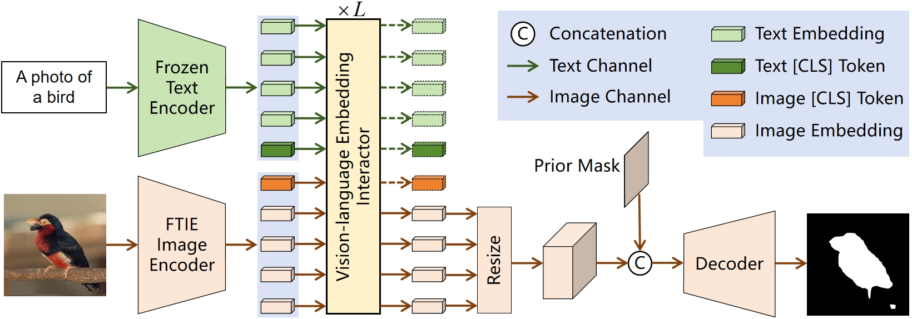

# ESDA: Zero-Shot Semantic Segmentation Based on an Embedding Semantic Space Distribution Adjustment Strategy

> **Abstract:** Recently, the CLIP model, which is pre-trained on large-scale vision-language data, has promoted the development of zero-shot recognition tasks. Some researchers apply CLIP to zero-shot semantic segmentation, but they often struggle to achieve satisfactory results. This is because this dense prediction task requires not only a precise understanding of semantics, but also a precise perception of different regions within one image. However, CLIP is trained on image-level vision-language data, resulting in ineffective perception of pixel-level regions. In this paper, we propose a new zero-shot semantic segmentation (ZS3) method based on an embedding semantic space distribution adjustment strategy (ESDA), which enables CLIP to accurately perceive both semantics and regions. This method inserts additional trainable blocks into the CLIP image encoder, enabling it to effectively perceive regions without losing semantic understanding. Besides, we design spatial distribution losses to guide the update of parameters of the trainable blocks, thereby further enhancing the regional characteristics of pixel-level image embeddings. In addition, previous methods only obtain semantic support through a text [CLS] token, which is far from sufficient for the dense prediction task. Therefore, we design a vision-language embedding interactor, which can obtain richer semantic support through the interaction between the entire text embedding and image embedding. It can also further enhance the semantic support and strengthen the image embedding. Plenty of experiments on PASCAL and COCO prove the effectiveness of our method. Our method achieves new state-of-the-art for zero-shot semantic segmentation and exceeds many few-shot semantic segmentation methods.

<p align="middle">
  
</p>

### Dependencies

- RTX 3090
- Python 3.8
- PyTorch 1.12.0
- cuda 11.6
- torchvision 0.13.0
- tensorboardX 2.2


### Datasets

- PASCAL-5<sup>i</sup>:  [VOC2012](http://host.robots.ox.ac.uk/pascal/VOC/voc2012/) + [SBD](http://home.bharathh.info/pubs/codes/SBD/download.html)

- COCO-20<sup>i</sup>:  [COCO2014](https://cocodataset.org/#download)
- Put the datasets into the `data/` directory.
- Download the data lists from [BAM](https://github.com/chunbolang/BAM).

### Models

- Download the pre-trained [CLIP(ViT-B/16)](https://openaipublic.azureedge.net/clip/models/5806e77cd80f8b59890b7e101eabd078d9fb84e6937f9e85e4ecb61988df416f/ViT-B-16.pt) and put them into the `model/backbone/pretrain_model` directory.


### Scripts

- Change configuration and add weight path to `.yaml` files in `config` directory, then run the `train.sh` file for training or `test.sh` file for testing.

### Performance

Performance comparison with the state-of-the-art approachs in terms of **average** **mIoU** across all folds. 


   | Backbone  | Method       | PASCAL-5i               | COCO-20i                 |
   | --------  | ------------ | ------------------------| ------------------------ |
   | ViT-B     | ClsCLIP      | 56.4                    | 37.0                     |
   | ViT-B     | ESDA(ours)   | 58.9                    | 37.1                     |


   


## References

This repo is mainly built based on [CLIP](https://github.com/openai/CLIP), and [BAM](https://github.com/chunbolang/BAM). Thanks for their great work!

````
This paper is currently being reviewed by the Image and Vision Computing journal.
